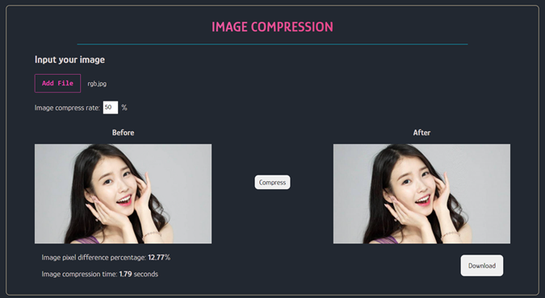
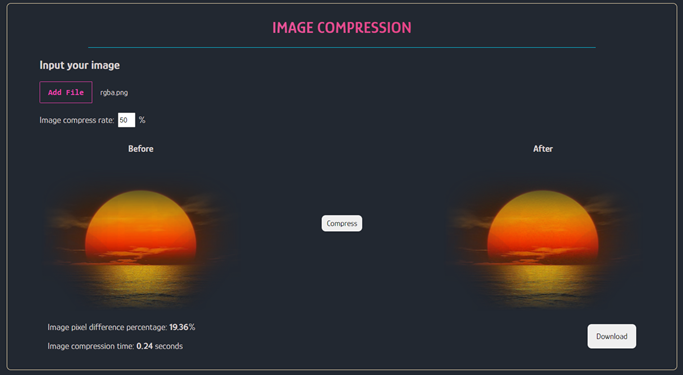
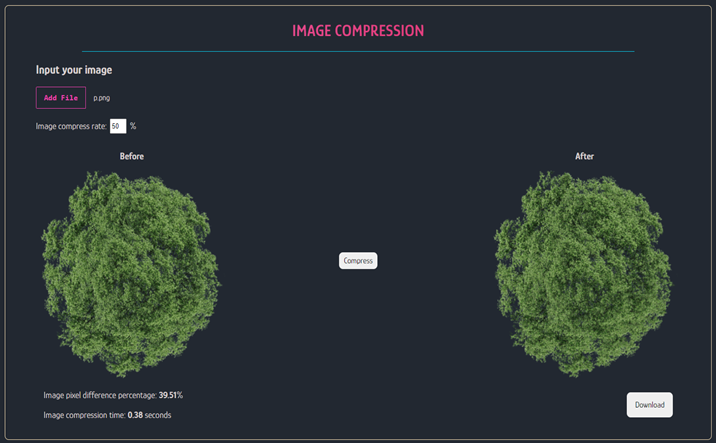
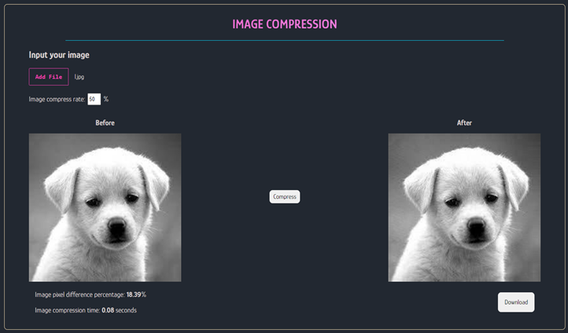
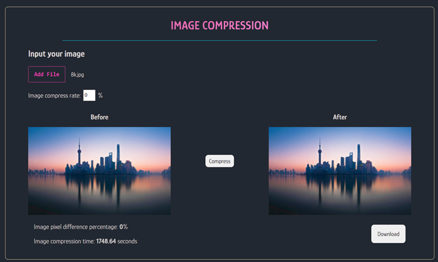

# TUGAS BESAR ALGEO 2
## Image Compression Program Using SVD Algorithm

Kelompok algeogeogeo:

| NIM       | Nama                     |
| --------- | ------------------------ |
| 13520066  | Putri Nurhaliza          |
| 13520072  | Jova Andres Riski Sirait |
| 13520084  | Adelline Kania Setiyawan |

```
TUGAS BESAR 2 - Geometric and Linear Agebra IF2123
Bandung Institute of Technology
```

## Table of Contents
- [General Info](#general-information)
- [Technologies Used](#technologies-used)
- [Features](#features)
- [Application Structures](#application-structure)
- [Screenshots](#screenshots)
- [Installation](#installation)

## General Information
This is an Image Compression Program using SVD (Singular Value Decomposition) algorithm built with flask python and vue.js. With image compression, we can reduce image file size without significantly affecting the image quality. The SVD algorithm is a decomposition of a matrix into an orthogonal matrix U, a diagonal matrix S, and a transpose of an orthogonal matrix V. In this program, we use QR Iteration to get the reconstructed SVD matrix.

## Technologies Used
- [Vue 3.0.0](https://vuejs.org/)
- [Flask 2.0.2](https://flask.palletsprojects.com/en/2.0.x/)
- [Python 3.9.0](https://www.python.org/)

## Features
* Flask 2.0 App
* Flask-RestX API with class-based secure resource routing
* Vue-Cli 4 + Node
* Axios for backend communication

* Image compression program using SVD algorithm <br>
Can maintain transparency <br>
Support:

| Mode | Format |
| ------------- | ------------- |
| <b>L, LA, RGB, RGBA, CMYK, P </b> |  <i> image/jpeg <br> image/png <br> image/bmp <br> image/webp  </i>|

## Application Structure
#### Rest Api
The Api serve using Flask blueprint at /api/

#### Client Application
A Flask view is used to serve the index.html as an entry point into the Vue app at the endpoint /.

#### Important Files
| Location             |  Content                                   |
|----------------------|--------------------------------------------|
| `/doc`               | Laporan                                    |
| `/eigen`             | Experimental Result File                   |
| `/src/frontend`      | Vue Application                            |
| `/src/backend`       | Flask Application                          |
| `/test`              | Image for testing purposes                 |

## Screenshots
- Image with RGB Mode

- Image with RGBA Mode

- Image with P and CMYK Mode

- Image with L and LA Mode

- Images with large dimensions

## Installation
#### Before you start <br><br>
Before getting started, you should have the following installed and running:

- [X] Node (v8.9 or above) - [instructions](https://nodejs.org/en/)
- [X] Vue Cli 4.x - [instructions](https://cli.vuejs.org/guide/installation.html)
- [X] Python 3
- [X] Pipenv (Optional: Install all dependencies manually if not using pipenv)

#### Template and Dependencies

* Clone this repository:

  ```
  $ git clone https://github.com/Putriliza/Algeo02-20066.git
  ```

* Install backend dependencies (Pipenv):
  ```
  In the backend folder
  $ pip install pipenv (Optional: if pipenv not intalled)
  $ pipenv install --dev
  $ pipenv shell
  ```

* Install JS dependencies:
  ```
  In the frontend folder
  $ npm install
  ```

### Development Server

Run Flask Api development server:

```
In the backend folder
$ python server.py
```

From another tab, start the webpack dev server:

```
In the frontend folder
$ npm run serve
```

The Vue js application will be served from `localhost:8080` and the Flask Api
and static files will be served from `localhost:5000`.

The dual dev-server setup allows you to take advantage of
webpack's development server with hot module replacement.

Proxy config in `vue.config.js` is used to route the requests
back to Flask's Api on port 5000.

If you would rather run a single dev server, you can run Flask's
development server only on `:5000`, but you have to build build the Vue app first
and the page will not reload on changes.

```
In the frontend folder
$ npm run build

In the backend folder
$ python server.py
```

```
DONE!
```